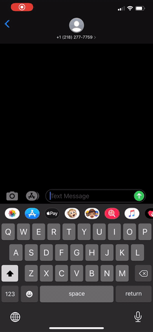

# Smell Ya Later
This project represents the solo work of Jake West. For full functionality, you need access to both my ([Front End](https://github.com/jkwest-93/Smell-Ya-Later)) and ([Back End](https://github.com/jkwest-93/Smell-Ya-Later-Express)) repos.

## Project Overview
Our sense of smell is heavily intertwined with our emotions and memories. In the wake of the COVID-19 pandemic, an unprecedented number of people report experiencing a partial or complete loss of smell. A growing body of research indicates that smell therapy may help these individuals regain their sense of smell more quickly. This type of treatment encourages users to spend conscious time daily smelling a few items from their unique smell kit.

Smell Ya Later is designed to help users engage with their smell kit and track their progress over time. Once a user has input their contact information, they are able to receive text message prompts to go smell a specific item, and then report back on their experience using a 1 to 5 scale. Users can view their recent activity in the Activity page, where they are also able to delete ratings for any item.

## Tech Stack
- React, as my primary front end framework
- Express, to build a back end server ([Smell Ya Later Express](https://github.com/jkwest-93/Smell-Ya-Later-Express))
- Twilio SMS API, to allow text message reminders
- ngrok, to open a port between the Twilio API and my app
- React Router to handle navigation
- Test driven development with React Testing Library

## Installation Instructions
- Close down both the ([Front End](https://github.com/jkwest-93/Smell-Ya-Later)) and ([Back End](https://github.com/jkwest-93/Smell-Ya-Later-Express)) repositories.
    - When you run git clone, you can name the project as you choose like this (you replace the [...] with the terminal command arguments): git clone git@github.com:jkwest-93/Smell-Ya-Later.git [...]
- Be sure to run `npm install` in both projects to update dependencies.
- Move into the Back End directory, and complete the following steps:
    - Run `nodemon server.js` to run the Back End locally.
    - Then, run `ngrok http 1337` to make your Back End server available to network requests from Twilio.
- To launch the Front End, run `npm start`, allowing you to view the app in the browser.

## Project in Action
- On the home page, users are met with a pre-determined smell kit informed by items used in prior research, as well as some things you could expect to find around the house. From here, as well as any other page, users are able to get more information about my app from the `About` dropdown.

- To start receiving text messages, users must update their contact information in the `User Profile` page. Once this is submitted, users are able to return to the home page and click on any item in their kit. This click event triggers the text message prompt to the users phone number.

- Once a user replies to this prompt, they are able to see their all of their ratings in the `Activity` page. Users are provided with all of there ratings, separated by item, and ordered chronologically by date and time.

## Wins and Challenges
I celebrated a number of wins while I was working on this project! This was my first time building my own back end server with Express, as well as learning how to use the Twilio SMS API. I spent a lot of time combing through documentation and various tutorials to write code that fit my needs. Because I was working on a Front End and Back End project in tandem, I had to use strong project management skills as I connected all of these moving parts together.

I ran into a few obstacles along the way, so this app definitely has it's limitations! When I originally started dreaming up this project, I imagined that users would be able to receive text message prompts throughout the day. Because of my time constraints, and that I'm new to back end development, I settled for creating text message functionality that responds to a button click. In the future, I would like to add onto my back end to allow users to receive messages even when they are away from their computer.

All in all, this was a great opportunity for me to learn new technical skills while continuing to refine my workflow with React. This was one of the first apps I've built where I had complete agency over the product. This is exciting to me, as it allowed me to merge my interests in creating tech solutions to community-facing problems with my growing skillset as a developer.

## Contributors
Jake West: [GitHub](https://github.com/jkwest-93) | [LinkedIn](https://www.linkedin.com/in/jake-west-3840b71b4/)
